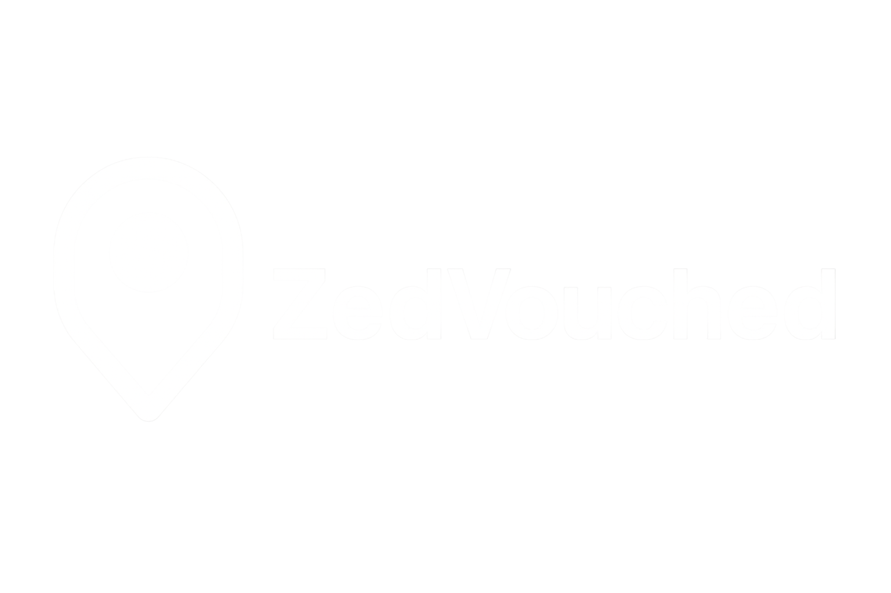

<!DOCTYPE html>
<html lang="en">
<head>
  <meta charset="UTF-8" />
  <meta name="viewport" content="width=device-width, initial-scale=1.0" />
  <title>ZedVouched</title>

  <!-- Base URL for correct asset resolution (modify to match your repo path if needed) -->
  <base href="https://username.github.io/your-repo/" />

  <!-- Google Fonts with fallback -->
  <link href="https://fonts.googleapis.com/css2?family=Inter:wght@400;500;600;700&display=swap" rel="stylesheet" />

  <!-- Tailwind CDN -->
  

  <!-- CSS Reset (optional but improves cross-browser consistency) -->
  

  <!-- Custom Styles -->
  
</head>
<body>

  <!-- Header -->
  <header class="flex items-center justify-between py-4 px-6">
    

      
      ZedVouched
    

    <nav class="hidden lg:flex items-center space-x-6 text-base font-medium">
      <!-- Dropdown Menu -->
      

        <button class="flex items-center space-x-1 hover:text-orange-600" aria-haspopup="true">
          Technical Services
          <svg class="w-4 h-4" fill="none" stroke="currentColor" viewBox="0 0 24 24" aria-hidden="true">
            <path d="M19 9l-7 7-7-7"></path>
          </svg>
        </button>
        <ul class="absolute hidden group-hover:block bg-white text-black mt-2 rounded shadow-lg w-48 text-sm">
          <li><a href="#plumber" class="block px-4 py-2 hover:bg-gray-100">Plumber</a></li>
          <li><a href="#mechanic" class="block px-4 py-2 hover:bg-gray-100">Mechanic</a></li>
          <li><a href="#welder" class="block px-4 py-2 hover:bg-gray-100">Welder</a></li>
          <li><a href="#carpenter" class="block px-4 py-2 hover:bg-gray-100">Carpenter</a></li>
          <li><a href="#electrician" class="block px-4 py-2 hover:bg-gray-100">Electrician</a></li>
          <li><a href="#technician" class="block px-4 py-2 hover:bg-gray-100">Technician</a></li>
        </ul>
      

      <a href="#" class="hover:text-orange-600">Design Services</a>
      <a href="#" class="hover:text-orange-600">Domestic & Support</a>
      <a href="#" class="hover:text-orange-600">Administrative</a>
      <a href="#" class="hover:text-orange-600">Logistics</a>
      <a href="https://wa.me/260978109185" class="px-4 py-2 bg-green-700 text-white rounded shadow hover:bg-green-800">WhatsApp</a>
    </nav>
    <button class="lg:hidden px-2 py-1 bg-white rounded" aria-label="Open menu">
      <svg class="w-6 h-6 text-gray-800" fill="none" stroke="currentColor" viewBox="0 0 24 24">
        <path d="M4 6h16M4 12h16M4 18h16"></path>
      </svg>
    </button>
  </header>

  <!-- Hero Section -->
  <main>
    <section class="flex flex-col lg:flex-row items-center px-6 lg:px-24 pt-12 animate-fade">
      

        <h1 class="text-5xl md:text-6xl lg:text-7xl font-bold mb-6 leading-tight">
          Let’s fill the Zambian map, together
        </h1>
        <blockquote class="bg-semi-transparent-card p-4 rounded mb-6 max-w-md text-gray-800">
          Search local workers and businesses trusted and vouched for by Zambians…
        </blockquote>
        <button class="btn-green text-white px-6 py-3 rounded shadow mb-4 w-max">Search</button>
      

      

        

          <h2 class="text-xl font-semibold text-black mb-4">Nominate a Provider</h2>
          <form action="https://formsubmit.co/your@email.com" method="POST" enctype="multipart/form-data">
            <!-- Inputs preserved -->
            <!-- ... -->
          </form>
        

      

    </section>

    <section class="px-6 lg:px-24 pt-16 animate-fade">
      

        

          <h2 class="text-5xl md:text-6xl lg:text-7xl font-bold leading-tight">
            Your Map to Zambia’s Trusted Service Providers
          </h2>
        

        

          <iframe
            src="https://www.google.com/maps/d/embed?mid=1LQXoxhIWpbgSo7cwGqGIzcfA8jWEMM4&ehbc=2E312F"
            width="100%"
            height="480"
            allowfullscreen
            loading="lazy"
            title="ZedVouched Provider Map"
          ></iframe>
        

      

    </section>
  </main>

  <!-- Footer -->
  <footer class="mt-16 px-6 lg:px-24 py-6 text-center text-gray-800 text-sm animate-fade">
    &copy; 2025 ZedVouched | Built with ❤️ in Zambia
  </footer>
</body>
</html>
